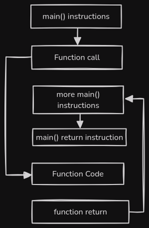

# Aim
This is to look at the difference between inline variable increments.
These are all different ways to assign values from 0 to 10 in an array
in order, with a while loop:

The three methods are:
```C
int arr[10];
while( i < 10 ) {
    arr[i] = i; i++; // The standard way.
    arr[i++] = i; // The inline way.
    arr[i] = i++; // The incorrect way.
}
```

We are going to look at the different assembly code to these applcations
for the following aims...
- The standard way:
    - Understand assembly implementations of:
        1) array indexing (`arr[i]`)
        2) incrementing (`i++`)
    - Understand the order in which an address is retrieved and assigned to.
- The inline way:
    - Understand the order in which the address is retrieved, assigned to, and incremented.
- The incorrect way:
    - At what point does the incrementation happen.

If i'm honest I can pretty much guess the answer to the abstract implementation, but I do
not know specifically the assembly commands, and structuring. From learning LLVM IR I
understand that the memory address is found, stored into a register, then the value being
assigned is loaded (either direct or immediate addressed) and then the value is assigned.

# File structure
All source files (obviously) have the `.c` file extension, and all assembly files have the
`.s` file extension, and the related files have the same name. The names match the code
snippets under the [aim](#aim). The source files are called:
- [standardWay.c](./standardWay.c)
- [inlineWay.c](./inlineWay.c)
- [incorrectWay.c](./incorrectWay.c)

### Admission of Ignorance
Before writing the code, I made initial guesses on which methods will be correct and
incorrect. I incorrectly guessed the following:
```
arr[i] = i++; // Was the correct way.
arr[i++] = i; // Was the incorrect way.
```
And named the files accordingly. When I wrote the tests I realised I was wrong. I
initially thought the memory was accessed/ loaded in chronological order, but this seems
not the case.

I have changed the names of the files to correctly identify the correct (inline) and
incorrect method.

# Compilation
The [build](./build) bash script is used to compile and produce the assembly code. The
usage is found with:
```
$ ./build -h
Usage: ./build [-clean-asm] [-clean] file_basename
	-clean-asm: Remove all assembly files.
	-clean: Remove all assmbly and executable files.
```

Where `file_basename` is the file name with the file extension omitted.

# Document Structure
It may not be the right way to write a document like this, but the document will be written
and is intended to be read in chronological order. The subsequent sections may assume
knowledge from the previous sections. So feel free to skip sections, but you may have to
read the preceeding sections anyway.

# Preamble
I am running on an aarch 64 machine, so all my this information will rely on the following resources:
- Aarch64 Procedure Call Standard (https://github.com/ARM-software/abi-aa/blob/main/aapcs64/aapcs64.rst)
- Learn the architecture - A64 Instruction Set Architecture (https://developer.arm.com/documentation/102374/0102)
- ARM Compiler toolchain Using the Assembler (https://developer.arm.com/documentation/dui0473/c)

Also I used ChatGPT to help me with wording some concepts.

When writing this document I am in the early stages of learning and understanding assembly
language so I will strive to produce a clear explanation of the concepts concerning this
investigation.

# Investigation:
## Brief Lesson on Assembly
To understand the difference in implementation of the different methods, we must first
understand a little about assembly. This section will provide a brief explanation on the
assembly implementation of [standardWay.c](./standardWay.c) (it is useful to learn and
thoroughly understand this source code).

To follow the assembly you can either look at [standardWay.asm](./standardWay.asm) or
to look at [main.c](./main.c) and find the label `0000000000000b4c <standardWay>:`.

### Calling the function:
In assembly there are no function calls, there are no subroutines or function calls. But
instead there is branching. Branching allows you to skip forward (and backward) to another
instruction. Branching can be done unconditionally or conditionally.

When calling a function in assembly you do not _call_ anything, you instead skip forward
to the instruction that runs the functions code and then after the function is executed you
branch back to resume execution. Look at the below flowchart, all the blocks is one 
large code chunk, where the code of each block is immediately after the previous block.



In the function call, the execution flow skips down to the function logic, and then when
function logic is completed, the flow skips back to the line of `main()` immediately after
the function code.

### Registers and Function Parameters:
There are 31 accessible registers (r0-r30), but some of then have special functions. These
registers can be accessed as a 64 bit register by using `xn` or a 32 bit register by using
`wn`, where `n` is the register number. The called function can modify registers 0-15
freely.

When storing, the data being stored dependsd on the register being accessed. Storing `x0`
into memory would save all 64bits whereas storing `w0` would only store 32 bits.

when calling a function, registers r0 to r7 are used for parameter passing, and any further
parameters are passed onto the stack.

The vast majority of operations we are going to look at uses registers. So it is important
to track when registers are being loaded to, stored to memory, and operated on as registers
are not automatically saved to memory.

There are two Zero Registers (`wxr` and `xzr`) which always reads 0 no matter what is
stored onto it.

### The Stack
The stack is pointed to by the stack pointer (`sp`). The stack has the following properties:
1. The Stack Pointer is always 16-byte aligned.
2. The stack grows downward (memory is assigned from the highest memory address first)

This means that for the stack to grown, the stack pointer is subtracted (grows downward) by
a multiple of 16 (to keep 16-byte alignment).

### Addressing
Although registers are the most used operand in commands, there are other ways to address 
data:
- Immediate addressing: Specify the constant being used. Denoted by `#`.
- Register addressing: Specify the register.
- Direct Addressing: Specify the memory address.

The memory Address will frequently be accessed using 'Pre-indexed addressing' which is in
the form `[addr, op2]`, which references the address `addr+op2` (you will see this when
accessing stack memory).

### standardWay.asm
Take a look at [standardWay.asm](./standardWay.asm). I am going to explain the instructions
in chunks, but in each code snippets, the comments (prepended with `;` will give a brief
desripion of the line. Note: `TAS` = The Above Snippet

```asm
b4c: d10043ff     	sub	sp, sp, #0x10   ; Subtrack stack pointer by 16 (remember alignmen)
b50: f90007e0     	str	x0, [sp, #0x8]  ; store the value of x0 (param 1) into sp+8
b54: b90007ff     	str	wzr, [sp, #0x4] ; Zero 4bytes starting from sp+4
```
The above snippet grows the stack by 16 bytes, stores the first argument into sp+8.
Since sp+4 is a 4byte and is assigned to 0, we can gather that sp+4 is the address
of variable `i`, from here onwards the comments will use the name `i` as oppose to
address `sp+4`, and variable `arr` as oppose to address `sp+8`.

```asm
b58: 14000001     	b	0xb5c <standardWay+0x10>                ; Jump to the next instruction
b5c: b94007e8     	ldr	w8, [sp, #0x4]                          ; w8 = i
b60: 5290d409     	mov	w9, #0x86a0                             ; w9 = 0x86a0
b64: 72a00029     	movk	w9, #0x1, lsl #16                   ; w9 = w9 OR (0x1 << 16)
b68: 6b090108     	subs	w8, w8, w9                          ; w8 = w8 - w9
b6c: 1a9fb7e8     	cset	w8, ge                              ; w8 = (w8 >= 0)
b70: 37000148     	tbnz	w8, #0x0, 0xb98 <standardWay+0x4c>
```

TSA is the logic for the condition in the while loop. It gets the value of
`i` and stores it inot `w8`, then loads the boundary, 100000, into `w9` and uses a
subtraction and the resulting ALU flags to test if `w8 >= w9`. `tbnz` gets the 
0th bit of w8, and branches to instruction `0xb98` if that bit is non-zero. If the
bit is non-zero then the program branches to the code after the while loop.

Assigning `w9` to 100000 requires 2 steps because the immediate addressed value
of `mov` can be at most 16 bits and the value being assigned is `0x0186a0` (17
bits). Therefore we use 2 statements:
- `mov` to assign the lower 16 bits (0x86a0) to `w9`.
- `movk` to left shift the constant `1` 16 times and bitwise `OR` the value to
the current value of `w9` (`0x86a0 OR 0x10000 = 0x186a0 = 0d100000`).

```asm
b74: 14000001     	b	0xb78 <standardWay+0x2c>    ; Branch to the next instruction.
b78: b94007e8     	ldr	w8, [sp, #0x4]              ; w8 = i
b7c: f94007e9     	ldr	x9, [sp, #0x8]              ; x9 = arr
b80: b98007ea     	ldrsw	x10, [sp, #0x4]         ; x10 = (64bit) w8
b84: b82a7928     	str	w8, [x9, x10, lsl #2]       ; x9[x10<<2] = w8
b88: b94007e8     	ldr	w8, [sp, #0x4]              ; w8 = i
b8c: 11000508     	add	w8, w8, #0x1                ; w8 = w8 + 1
b90: b90007e8     	str	w8, [sp, #0x4]              ; i = w8
b94: 17fffff2     	b	0xb5c <standardWay+0x10>
```

Before we delve into TSA, lets remind ourselves about the parameter stored in
`sp+8`. This array is an array of integers (32 bits each), and offsetting is
in steps of one byte, so each element starts every 4 bytes from the base
address. Therefore to get the i<sup>th</sup> element from base address `sp`,
you would use `sp+(i*4)`, or the equivalent `sp+(i<<2)`. I did not find a
reason in the documentation behind the casting of `w8` to 64 bits, but I would
assume that it is to allow a greater range in representable values, reducing
the chance of overflow.

TSA handles the loops body and gets the `i`<sup>th</sup> integer value of `arr`
and assigns it to `i`, and then increments `i`. The branch jumps back to the
series of instructions that handle the loops condition.

```asm
b98: 2a1f03e0     	mov	w0, wzr         ; zero register w0
b9c: 910043ff     	add	sp, sp, #0x10   ; Shrink the stack
ba0: d65f03c0     	ret
```

TSA zero's `w0` as that would be the returned value of the function, and then
shrinks the stack back to its original size. Then the `ret` command
unconditionally branches back to the next instruction (pointed to by the LR).
This is not seen in these snippets but this function is branched to using the
`bl` command, which branches to the destination instruction while storing the 
next instruction in the Link Register `lr` (which is how the program knows
where to branch back with `ret`).


Now we should have somewhat of an understanding on the correlation between
the source code and the assembly. understanding the above will help in the
next sections.

## Running `main`
If you run main with:
```
$ ./main 2>log.txt
```

You get an output similar to (the times may change):
```
The Standard Way:
	PASSED: arr[i] = i
Time: 94

The inline Way:
	PASSED: arr[i] = i
Time: 353

The incorrect Way:
	FAILED: 99999 index-value pairs do not match.
Time: 114
```
After running 10 times we get the following average times:
|Algorithm:|Processor Time:|
|:--------:|--------------:|
|Standard Way|142.2|
|Inline Way|524.7|
|Incorrect Way|127.1|

NOTE: We are reading in processor time over 100000 iterations. So the differences in
processing costs is minute.

Initial Observations:
- The incorrect way is the fastest and the inline way is the slowest.
- Even though both the incorrect and inline way have an inlined incrementation, the
incorrect way is 400% quicker.
- Having two separate statements are quicker than incrementing upon memory access.

